# ABAC Mixin Authorization Workflow Diagram

## Complete Authorization Flow

```mermaid
sequenceDiagram
    participant Client
    participant API as Express API
    participant Service as Dashboard Service
    participant ABAC as ABAC Mixin
    participant Rules as Permission Rules
    participant Auth as Authorization Engine

    Note over Client,Auth: 🔐 ABAC Authorization Flow - Simplified

    %% Step 1: User Request
    Client->>API: 1. POST /dashboard-read
    Note right of Client: 📝 User sends request with JWT token

    %% Step 2: Authentication
    API->>API: 2. Validate JWT & Extract User
    Note right of API: ✅ Token valid → User identified

    %% Step 3: Route to Service
    API->>Service: 3. Call dashboard service
    Note right of API: 🚀 Forward request to Moleculer service

    %% Step 4: Load User Context
    Service->>Service: 4. Load user data
    Note right of Service: 👤 Get user info & roles from database

    %% Step 5: Permission Check
    Service->>ABAC: 5. Check permissions
    Note right of Service: 🔍 ABAC validates access rights

    %% Step 6: Load Rules
    ABAC->>Rules: 6. Get role permissions
    Rules->>ABAC: admin: ["dashboard:read|write"]
    Note right of Rules: 📋 Load permissions from JSON file

    %% Step 7: Build Authorization
    ABAC->>Auth: 7. Build user abilities
    Auth->>ABAC: ✅ Permissions configured
    Note right of Auth: ⚙️ Create CASL ability object

    %% Step 8: Validate Action
    ABAC->>ABAC: 8. Check: can("read", "dashboard")?
    
    %% Decision Point
    alt ❌ Permission Denied
        ABAC->>Client: 403 Forbidden
        Note right of ABAC: 🚫 User lacks required permissions
    else ✅ Permission Granted
        ABAC->>Service: Permission OK
        Service->>Service: 9. Execute business logic
        Service->>Client: 200 Success + Data
        Note right of Service: 🎉 Return dashboard data
    end
```



## 📝 Simple Step-by-Step Explanation

### **What happens when a user tries to access a protected resource:**

1. **🚀 User Request**: Client sends a request to read dashboard data
2. **🔐 Authentication**: API validates the JWT token and identifies the user  
3. **📞 Service Call**: Request is forwarded to the Dashboard Moleculer service
4. **👤 User Loading**: Service loads user information and roles from database
5. **🛡️ Permission Check**: ABAC mixin validates if user can access the resource
6. **📋 Rule Loading**: System loads user's role permissions from configuration file
7. **⚙️ Ability Creation**: CASL creates an "ability" object with user's permissions
8. **✅ Permission Decision**: Check if user can perform the requested action
9. **🎯 Result**: Either return data (if allowed) or error (if forbidden)

### **Key Components:**
- **ABAC Mixin**: The security guard that checks permissions
- **Permission Rules**: JSON file containing what each role can do
- **CASL**: Library that makes the final "allow/deny" decision
- **Service Hooks**: Automatically run permission checks before actions

### **Permission Format:**
```json
{
  "admin": ["dashboard:read|write|update|delete"],
  "user": ["dashboard:read"]
}
```
This means admins can do everything, while users can only read.

## ABAC Component Architecture

```mermaid
graph TB
    subgraph "ABAC System Components"
        AbacMixin[ABAC Mixin<br/>checkPermissions()]
        DefineRules[defineRulesFor()<br/>Rule Generator]
        Types[Type Definitions<br/>User, CaslMixinOptions]
    end
    
    subgraph "Configuration Files"
        RolePerms[role-permissions.json<br/>Role → Permissions]
        ResourceAttrs[Resource Attributes<br/>Dynamic/Static]
    end
    
    subgraph "CASL Library"
        AbilityBuilder[AbilityBuilder<br/>Rule Construction]
        MongoAbility[MongoAbility<br/>Permission Engine]
    end
    
    subgraph "Moleculer Service"
        Service[Dashboard Service]
        ActionMeta[Action Meta<br/>ABAC Configuration]
        Hooks[Before Hooks<br/>User Setup + Auth]
    end
    
    %% Connections
    Service --> Hooks
    Hooks --> AbacMixin
    AbacMixin --> DefineRules
    DefineRules --> RolePerms
    DefineRules --> ResourceAttrs
    DefineRules --> AbilityBuilder
    AbilityBuilder --> MongoAbility
    MongoAbility --> AbacMixin
    ActionMeta --> AbacMixin
    Types --> AbacMixin
    Types --> DefineRules
```

## Permission Decision Flow

```mermaid
flowchart TD
    Start([User Request]) --> Auth{User<br/>Authenticated?}
    Auth -->|No| AuthError[401 Unauthorized]
    Auth -->|Yes| ExtractUser[Extract User from Context]
    
    ExtractUser --> LoadRoles[Load User Roles]
    LoadRoles --> LoadPerms[Load Role Permissions<br/>from JSON file]
    LoadPerms --> DefineResources[Define Resource Attributes]
    
    DefineResources --> BuildAbility[Build CASL Ability<br/>with Rules]
    BuildAbility --> ExtractMeta[Extract ABAC Meta<br/>from Action]
    
    ExtractMeta --> ValidateMeta{ABAC Meta<br/>Valid?}
    ValidateMeta -->|No| MetaError[500 ABAC_META_MISSING]
    ValidateMeta -->|Yes| CheckPermission[ability.can(action, subject, condition)]
    
    CheckPermission --> HasPermission{Permission<br/>Granted?}
    HasPermission -->|No| PermError[403 Forbidden]
    HasPermission -->|Yes| ExecuteAction[Execute Service Action]
    
    ExecuteAction --> Success[Return Response]
    
    %% Error paths
    AuthError --> ErrorResponse[Return Error]
    MetaError --> ErrorResponse
    PermError --> ErrorResponse
    
    %% Success path
    Success --> End([Response to Client])
    ErrorResponse --> End
```

## Role-Based Permission Resolution

```mermaid
graph LR
    subgraph "User Information"
        User[User Object<br/>id: user123<br/>roles: ['admin', 'site_manager']]
    end
    
    subgraph "Role Permissions Lookup"
        RoleFile[role-permissions.json]
        AdminPerms[admin:<br/>dashboard:read|write|update|delete<br/>room:read|create|update|delete]
        SiteManagerPerms[site_manager:<br/>site:view|edit<br/>device:read|reboot]
    end
    
    subgraph "Resource Attributes"
        ResourceObj[resourceObj:<br/>dashboard: [{id: 'dash-1', permissions: ['write']}]<br/>room: [{id: 'room-1', permissions: ['read']}]]
    end
    
    subgraph "CASL Ability Rules"
        Rules[Generated Rules:<br/>can('read', 'dashboard')<br/>can('write', 'dashboard', {dashboard: 'dash-1'})<br/>can('view', 'site')<br/>can('read', 'room', {room: 'room-1'})]
    end
    
    User --> RoleFile
    RoleFile --> AdminPerms
    RoleFile --> SiteManagerPerms
    AdminPerms --> ResourceObj
    SiteManagerPerms --> ResourceObj
    ResourceObj --> Rules
```

## Service Integration Pattern

```mermaid
classDiagram
    class DashboardService {
        +constructor(broker)
        +parseServiceSchema()
        -beforeHooks[]
        -actions{}
    }
    
    class AbacMixin {
        +checkPermissions(ctx)
        -validateUser()
        -validateAbacMeta()
        -checkAbility()
    }
    
    class Action {
        +meta.abac.action
        +meta.abac.resource
        +handler(ctx)
    }
    
    class Context {
        +meta.user
        +meta.ability
        +params
        +action
    }
    
    class DefineRulesFor {
        +defineRulesFor(user, resources)
        -loadRolePermissions()
        -processResourceAttributes()
        +return MongoAbility
    }
    
    DashboardService --> AbacMixin : mixins
    DashboardService --> Action : contains
    Action --> Context : receives
    AbacMixin --> DefineRulesFor : calls
    AbacMixin --> Context : modifies
```

## Example Action Configuration

```typescript
// Example of how ABAC meta is configured in a service action
actions: {
  "dashboard-read": {
    meta: {
      abac: {
        action: "read",                    // What action is being performed
        resource: {
          dashboard: "dashboard-1"         // Which specific resource instance
        }
      }
    },
    params: { userId: "string" },
    async handler(ctx: Context) {
      // This action will only execute if:
      // 1. User is authenticated (ctx.meta.user exists)
      // 2. User has 'read' permission on 'dashboard'
      // 3. Resource attributes allow access to 'dashboard-1'
      return { message: "Dashboard data", dashboardId: "dashboard-1" };
    }
  }
}
```

## Key Decision Points

1. **User Authentication**: Must have valid user in context
2. **Role Resolution**: User roles determine base permissions
3. **Resource Attributes**: Fine-grained control over specific resource instances
4. **ABAC Meta Validation**: Each protected action must have proper ABAC metadata
5. **Permission Evaluation**: CASL evaluates if user can perform action on resource
6. **Error Handling**: Clear error responses for different failure scenarios

This workflow ensures secure, fine-grained authorization while maintaining flexibility and performance in a Moleculer.js microservices architecture.
